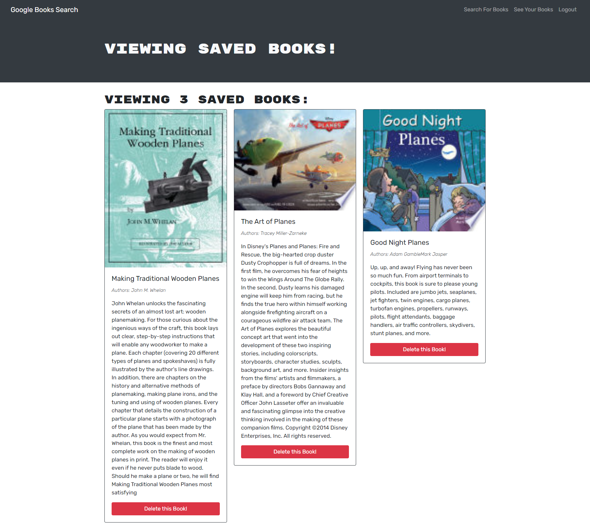

# book-search-engin

## Table of Contents
1. [Description](#description)
2. [Visuals](#visuals)
3. [Resources](#resources)

## Description

This assignment requires the user to switch the application from using routes to using schemas makes the api pages useless.

## Visuals

## Resources
- [Live Site](https://aqueous-coast-66546.herokuapp.com/)

- [Respository](https://github.com/Mortalmx13/book-search-engin)

